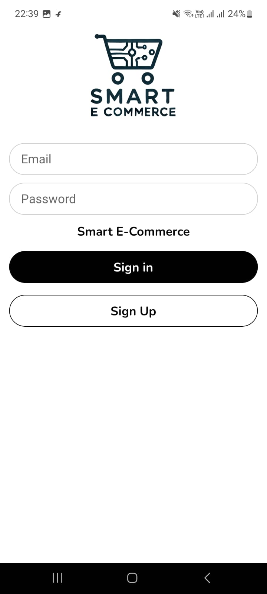
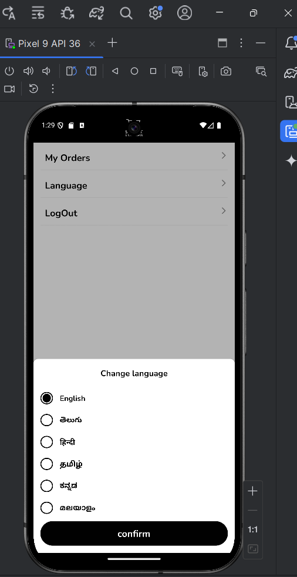
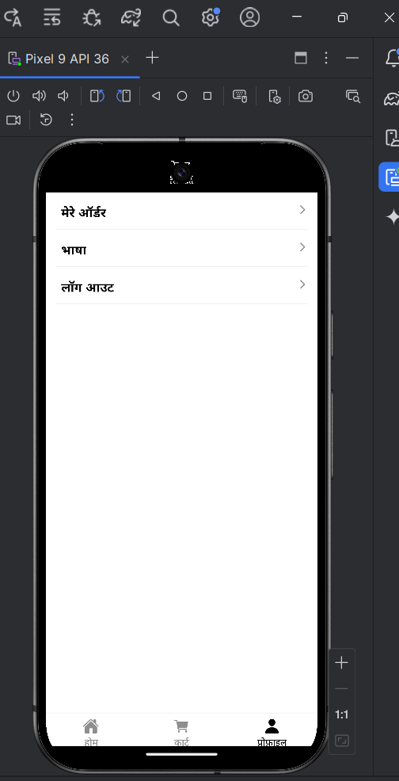
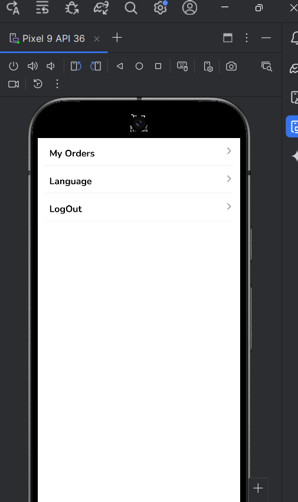
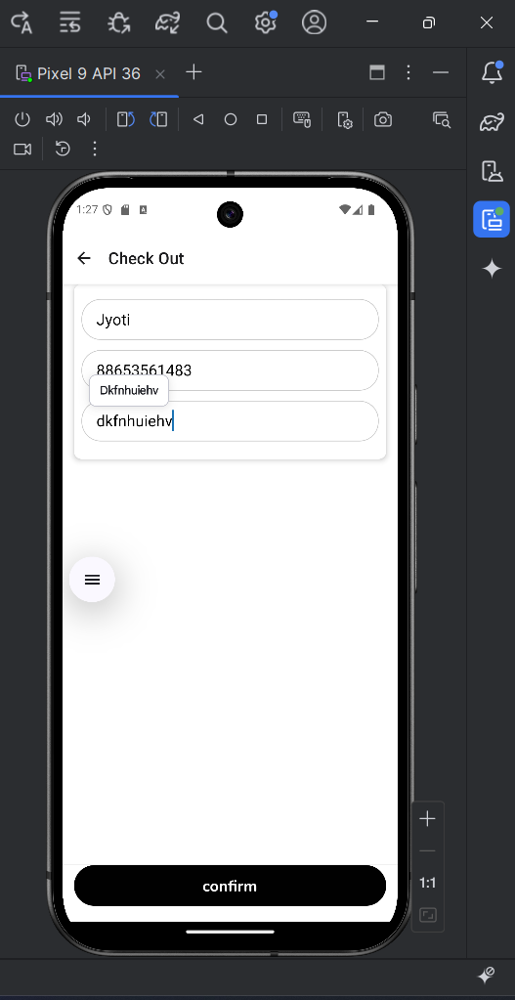
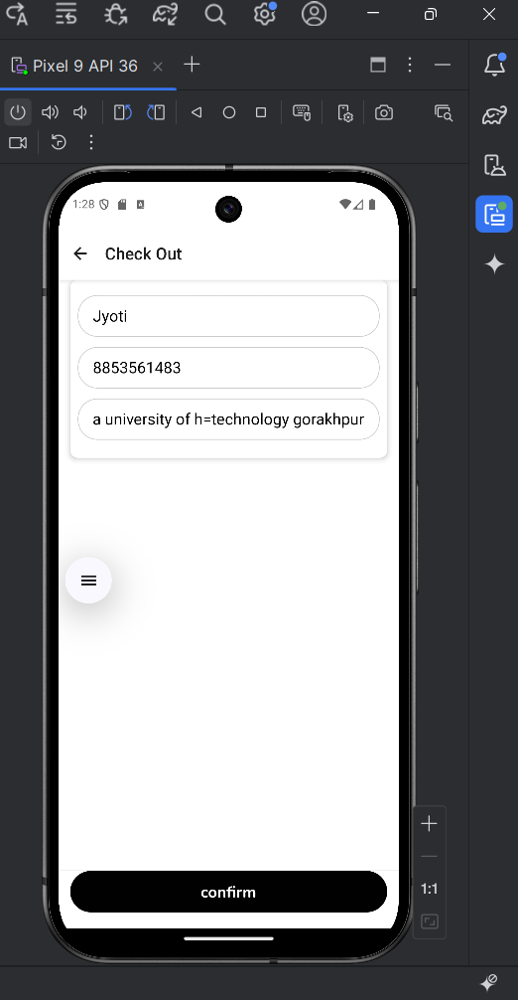

# Sri Task App
A mobile e-commerce app built with Expo and React Native.
Features: Add to cart, user authentication, and language switching (supports 5 languages).

🚀# Features
🛒 Add to Cart functionality for products

🌐 Language switcher (supports 5 languages)

👤 User authentication (login/register)

📦 Product listing and details

⚡ Fast, responsive UI

🔥 Firebase integration for backend (auth, Firestore for products/cart)

🏷️ No admin dashboard or admin controls

🛠️ #Setup & Installation
Prerequisites:

Node.js ≥ 16

Expo CLI

Firebase project (Firestore, Authentication)

#Steps:

Clone the repo:

bash
git clone https://github.com/your-username/sri-shop.git
cd sri-shop
Install dependencies:

bash
npm install
Configure Firebase:

Add your Firebase config to src/firebase/config.js.

Run the app:

bash
npx expo start

## Screenshots

